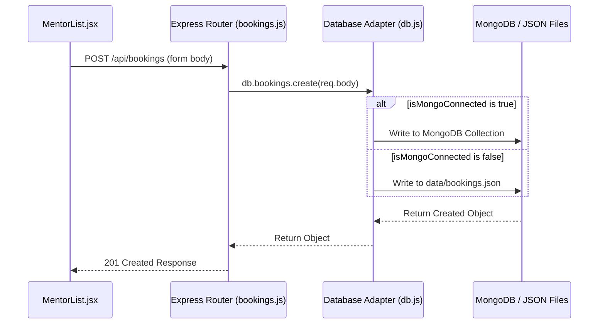

# DOCUMENTATION.md — Synapse Platform

Welcome to the **Synapse** documentation. Ye documentation ek developer-focused walkthrough hai jo aapko is project ke structure, flow, aur code implementation ko easily samajhne me help karega.

---

## 1. Project Overview
**Synapse** ek Alumni Mentorship aur Discussion platform hai jahan students aur college alumni aapas me connect kar sakte hain. Iska primary purpose college-to-career transition ko simplify karna hai.

### Core Objectives:
- **Mentor Profiles Directory**: Vetted alumni profiles explore karna.
- **1-on-1 Consultations**: Mentorship sessions book karna.
- **Open Discussion Forums**: Categories ke basis pe queries raise karna, upvote/like karna, aur alumni responses add karna.
- **Admin Dashboard**: System bookings approve/reject karna, analytics track karna aur naye mentors register karna.

---

## 2. Tech Stack
| Technology | Purpose | Version |
| :--- | :--- | :--- |
| **React** | Component-driven UI framework for building interactive views. | `^19.2.7` |
| **Express.js** | Server framework for API routes, middleware, and request handling. | `^4.19.2` |
| **Node.js** | JavaScript runtime environment. | `LTS (>=18)` |
| **Mongoose / MongoDB** | ODM for MongoDB documents and schema validation. | `^8.3.1` |
| **Vite** | Modern, fast build tool & dev server for the React frontend. | `^8.1.1` |
| **Lucide React** | Premium icon library. | `^1.23.0` |
| **Local JSON Fallback** | File-system-based data persistence when MongoDB is offline. | Native `fs` |

---

## 3. Folder Structure
```text
d:\kalum task
├── backend/
│   ├── data/                 # Local JSON Database files (Fallback database)
│   │   ├── bookings.json     # Mock bookings data
│   │   ├── forum.json        # Mock forum threads
│   │   └── mentors.json      # Mock mentor directory
│   ├── routes/               # Express API endpoint controllers
│   │   ├── bookings.js       # Booking CRUD and status PATCH endpoints
│   │   ├── forum.js          # Threads, Likes, and Comments controllers
│   │   └── mentors.js        # Mentor profile registration & filters
│   ├── .env                  # Port & MONGODB_URI local variables
│   ├── db.js                 # Dual-Persistence database adapter (Mongoose + JSON)
│   ├── package.json          # Node dependencies (Express, Mongoose)
│   └── server.js             # Main server setup & Express application listener
└── frontend/
    ├── src/
    │   ├── assets/           # Crop images & logos
    │   │   ├── hero_illustration.png # Cropped 3D campus-to-career graphic
    │   │   └── hero_connect.jpg      # Original source 3D mockup
    │   ├── components/       # Reusable layout assets
    │   │   └── ThreeHero.jsx # Unused Three.js background script (Globe)
    │   ├── pages/            # App Views
    │   │   ├── Dashboard.jsx # Metric summaries, bookings list, and registration
    │   │   ├── Forum.jsx     # Open Q&A categories, thread dialog, and replies
    │   │   ├── Home.jsx      # High-fidelity Neo-Brutalist landing visual
    │   │   └── MentorList.jsx# Filter directories and request modal
    │   ├── App.css           # Unused layout overrides
    │   ├── App.jsx           # Master shell, state routing, nav, and footer
    │   ├── index.css         # Neo-Brutalist theme system, utility tokens
    │   └── main.jsx          # React DOM entry point
    ├── index.html            # Mount template
    ├── package.json          # React, Vite, Lucide dependencies
    └── vite.config.js        # React plugin config
```

---

## 4. Setup Instructions

### Prerequisites
- Node.js (v18+)
- Local MongoDB instance running (Optional - Server automatically falls back to JSON database files if offline).

### Running Backend Locally
1. Navigate to the backend directory:
   ```bash
   cd backend
   ```
2. Install dependencies:
   ```bash
   npm install
   ```
3. Create a `.env` file (configured in template):
   ```properties
   PORT=5000
   MONGODB_URI=mongodb://localhost:27701/alumni-mentorship # optional
   ```
4. Start the server (runs on port `5000`):
   ```bash
   npm run dev
   ```

### Running Frontend Locally
1. Open a new terminal and navigate to the frontend directory:
   ```bash
   cd frontend
   ```
2. Install dependencies:
   ```bash
   npm install
   ```
3. Start the Vite server (runs on `http://localhost:5173`):
   ```bash
   npm run dev
   ```

---

## 5. Core Files Explanation

### Backend DB Layer: `backend/db.js`
* **Purpose**: Database connection check and Adapter Router.
* **Logic**:
  * `connectDB()` executes Mongoose connection checks.
  * Agar MongoDB online hai, `isMongoConnected` boolean flag `true` set hota hai aur database inputs directly MongoDB collections (`mentors`, `bookings`, `posts`) me push hote hain.
  * Agar MongoDB error data returns kare ya offline ho, to server gracefully fail hone ke bajaye local JSON folder (`backend/data`) me mapping structures write aur read karta hai. 

### Express Application: `backend/server.js`
* **Purpose**: API Routes mount & middleware setup.
* **Logic**:
  * Cross-Origin requests open rakhta hai (`cors('*')`).
  * Server start hote hi async `connectDB()` function trigger karta hai and listens on Port `5000` or custom environment variable ports.

### Master Shell: `frontend/src/App.jsx`
* **Purpose**: Base shell layout aur simple routing structure.
* **Logic**:
  * Local state `page` ke content key check kar `renderPage()` ke through pages component fetch karta hai (classic dynamic view switcher, no React Router overhead).
  * Sticky Glassmorphic Navbar aur professional multi-column grid footer renders.

### Design System: `frontend/src/index.css`
* **Purpose**: Global style token library.
* **Style**:
  * Neo-Brutalist theme variables styling.
  * Elements like `.card`, `.btn` have deep offsets `box-shadow: 0.4rem 0.4rem #05060f` and dark borders `border: 2.5px solid #05060f` to give a tactile, modern feel.

---

## 6. Features & Data Flow

### Feature 1: Booking a Consultation
1. **User Action**: Student selects a mentor profile from `MentorList.jsx` and clicks "Request 1-on-1 Consultation".
2. **Modal Interaction**: Input booking details (Name, Email, Date, Time Slot, Topic) are captured.
3. **API call**: Sends a `POST` request to `http://localhost:5000/api/bookings`.
4. **Backend Route Handler**: `routes/bookings.js` invokes `db.bookings.create()`.
5. **Data flow diagram**:


### Feature 2: Discussion Forum Thread Likes
1. **User Action**: User clicks the like button on a discussion card.
2. **API call**: Sends a `POST` request to `http://localhost:5000/api/forum/posts/:id/like`.
3. **Backend Route Handler**: `routes/forum.js` fetches IP address (`req.ip`) to toggle upvote lists.
4. **Database Logic**: `db.posts.like(id, ip)` searches array. If user IP exists, it removes it (unlike); if it doesn't, it pushes IP and increments like counts.

---

## 7. Third-party Services Used
* **Unsplash**: Image repository endpoints used to pull mock user profiles.
* **Google Fonts**: Inter Tight and Inter fonts imported at the top of the CSS file.

---

## 8. Known Issues / TODOs
* **Admin Verification**: Registered admin accounts are created immediately. A verification code or verification portal can be added for enterprise networks.
* **Likes Tracker**: Upvote list matches local user IP, which resets if network routing nodes change.

---

## 9. Glossary (Hinglish Definitions)
* **Neo-Brutalist Design**: Graphic pattern featuring flat backgrounds, heavy solid borders, and square box shadows that makes layouts pop.
* **Local JSON Fallback**: Database failover mechanism jo MongoDB connection collapse hone par files me data write aur read karta hai.
* **Vite**: Modern bundling tool jo fast dev reloading supports karta hai without heavy configurations.
* **CORS**: Security mechanism jo local web components ko backend ports se data connect karne deta hai.
* **Dynamic Switch Switcher**: React standard router ke bina custom conditional logic se components switch karne ka dynamic setup.
